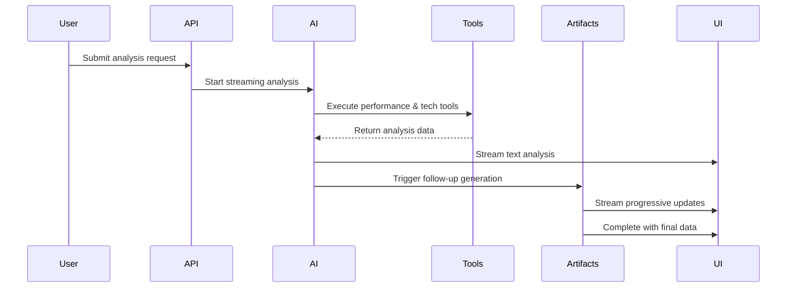

# AI System Overview

WebVitals.com's AI system provides intelligent, context-aware web performance analysis through a sophisticated combination of tools, artifacts, and streaming capabilities.

## 🏗️ Architecture

The AI system is organized into three main components:

```
ai/
├── tools/          # Data collection and analysis tools
├── artifacts/      # Streaming UI components  
└── context.ts      # Session and state management
```

### Design Philosophy

- **Tool-First Analysis**: AI tools gather raw performance and technology data
- **Streaming Artifacts**: Structured data streams to enhance the UI progressively
- **Context Awareness**: Shared state across tools and artifacts for coherent analysis
- **Progressive Enhancement**: Main analysis completes first, enhancements follow

## 🔧 AI Tools

Tools are AI-powered functions that collect and analyze data during conversations.

### Real World Performance Tool

Analyzes actual user performance using Chrome User Experience Report (CrUX):

```typescript
// Tool interface
getRealWorldPerformance({
  url: string;
  devices?: Array<'mobile' | 'desktop'>;
}) → RealWorldPerformanceOutput
```

**Capabilities:**
- Fetches 28-day rolling CrUX data from Google PageSpeed Insights API
- Supports configurable device analysis (mobile, desktop, or both)
- Transforms raw API data into structured performance metrics
- Provides Sentry-style performance categorization (Good/Needs Improvement/Poor)
- Handles missing data gracefully with appropriate fallbacks

**Data Output:**
```typescript
interface RealWorldPerformanceOutput {
  url: string;
  hasData: boolean;
  mobile?: {
    fieldData: {
      overallCategory: PerformanceCategory;
      metrics: FieldMetrics;
    }
  };
  desktop?: {
    fieldData: {
      overallCategory: PerformanceCategory; 
      metrics: FieldMetrics;
    }
  };
}
```

### Technology Detection Tool

Identifies website technologies using Cloudflare URL Scanner:

```typescript
// Tool interface  
detectTechnologies({
  url: string;
}) → TechDetectionOutput
```

**Capabilities:**
- Leverages Cloudflare's Wappa technology fingerprinting
- Detects frameworks, CMS, hosting, CDN, analytics, and more
- Provides confidence scores for each detected technology
- Categorizes technologies for easier analysis
- Handles scan queuing and completion waiting

**Data Output:**
```typescript
interface TechDetectionOutput {
  technologies: Array<{
    name: string;        // "React"
    confidence: number;  // 0-100
    categories: string[]; // ["JavaScript Frameworks"]
  }>;
}
```

### Tool Orchestration

Tools are executed in parallel for optimal performance:

```typescript
// In the AI system
tools: {
  getRealWorldPerformance: realWorldPerformanceTool,
  detectTechnologies: techDetectionTool,
}
```

## 🎯 AI Artifacts

Artifacts stream structured data to the UI after the main conversation completes, enabling progressive enhancement.

### Follow-up Actions Artifact

Generates contextual follow-up questions based on the complete analysis:

```typescript
// Artifact schema
{
  status: 'loading' | 'generating' | 'complete';
  progress: number; // 0-1
  url?: string;
  actions: Array<{
    id: string;
    title: string; // Follow-up question
  }>;
  context?: {
    generatedAt: string;
    basedOnTools: string[];
    conversationLength: number;
  };
}
```

**Generation Process:**
1. **Loading State**: Artifact starts streaming with loading status
2. **Data Collection**: Performance and technology data extracted from completed tools
3. **Context Building**: Full conversation history assembled for context
4. **AI Generation**: OpenAI generates relevant follow-up questions
5. **Progressive Updates**: Status updates stream to UI in real-time
6. **Completion**: Final artifact with generated actions

**AI Prompt Strategy:**
- Uses complete conversation history to avoid repetition
- Considers detected technology stack for relevant suggestions
- Always includes Sentry RUM suggestions unless already discussed
- Focuses on actionable next steps and implementation details

## 🔄 Streaming Architecture

### Real-time Data Flow



### Stream Management

The system uses `createUIMessageStream` for coordinated streaming:

```typescript
const stream = createUIMessageStream({
  execute: ({ writer }) => {
    // Set up context for artifacts
    setContext({
      writer,
      sessionId: `session-${Date.now()}`,
      analyzeUrl: performanceConfig ? "analysis-session" : undefined,
    });

    // Execute main analysis
    const result = streamText({
      model: openai("gpt-4o"),
      tools: { getRealWorldPerformance, detectTechnologies },
      onFinish: async ({ steps }) => {
        // Generate artifacts after main analysis
        await generateFollowUpArtifact(steps);
      }
    });

    writer.merge(result.toUIMessageStream());
  },
});
```

## 🧠 Context Management

### Typed Context System

Provides shared state across tools and artifacts:

```typescript
interface WebVitalsChatContext extends BaseContext {
  sessionId: string;
  analyzeUrl?: string;
  writer: ArtifactWriter; // For streaming artifacts
}
```

### Usage Patterns

**Setting Context (API Routes):**
```typescript
import { setContext } from "@/ai/context";

setContext({
  writer,
  sessionId: generateSessionId(),
  analyzeUrl: config.url,
});
```

**Accessing Context (Tools/Artifacts):**
```typescript
import { getCurrentSession } from "@/ai/context";

const session = getCurrentSession();
console.log(`Analysis session: ${session.sessionId}`);
```

## 🎨 AI Prompt Engineering

### System Prompt Strategy

The AI system uses carefully crafted prompts to ensure relevant, actionable analysis:

```typescript
export const webAnalysisSystemPrompt = `
You are a web performance analyst. Analyze websites using real user data and provide clear, actionable insights.

When analyzing a website (initial URL analysis):
1. Run getRealWorldPerformance and detectTechnologies tools in parallel
2. Use the device configuration from the request (mobile, desktop, or both)  
3. Write a concise analysis (150-200 words max) explaining what the performance data reveals and why it matters for users

Your responses should:
- Provide high-level insights about overall performance without repeating specific metric values (the UI displays detailed data separately)
- Explain user experience impact and business implications
- Consider the detected technology stack and how it affects performance
- Focus on interpretation and context rather than raw numbers
- Categorize performance using general terms (fast, average, slow) rather than specific CrUX categories
`;
```

### Follow-up Generation

Contextual follow-up questions use advanced prompting:

```typescript
// Example follow-up generation prompt
`You are analyzing web performance data and generating contextual follow-up questions.

PERFORMANCE DATA: ${JSON.stringify(performanceData)}
TECHNOLOGY DATA: ${JSON.stringify(technologyData)}
CONVERSATION HISTORY: ${conversationHistory}

Based on this data and conversation context, generate 3-6 practical follow-up questions that would be most valuable for the user to explore next.

Guidelines:
- Be specific to the actual performance issues found
- Consider the technology stack detected and suggest relevant optimizations
- Avoid repeating topics already covered in the conversation
- Focus on actionable next steps and implementation details
- ALWAYS include at least one suggestion about tracking Real User Metrics with Sentry performance monitoring unless RUM/Sentry has already been thoroughly discussed
`
```

## 🔍 Error Handling & Resilience

### Tool Error Recovery

```typescript
// Graceful degradation for tool failures
try {
  const performanceData = await getRealWorldPerformance(url);
} catch (error) {
  Sentry.captureException(error);
  // Continue with available data or provide fallback analysis
}
```

### Artifact Fallbacks

```typescript
// Fallback follow-up actions if AI generation fails
const fallbackActions = [
  {
    id: "sentry-rum-setup",
    title: "How do I set up Sentry to track Real User Metrics for Core Web Vitals?",
  },
  {
    id: "performance-basics", 
    title: "What are Core Web Vitals and why do they matter?",
  },
  // Additional fallback suggestions...
];
```

## 📊 Monitoring & Observability

### AI System Telemetry

```typescript
// Comprehensive tracking of AI operations
experimental_telemetry: {
  isEnabled: true,
  functionId: "pagespeed-analysis-chat",
  recordInputs: true,
  recordOutputs: true,
}
```

### Sentry Integration

- **Tool Execution Tracking**: Monitor success/failure rates of AI tools
- **Performance Metrics**: Track AI response times and tool execution duration
- **Error Reporting**: Comprehensive error tracking with context
- **Usage Analytics**: Track most common analysis patterns and follow-up questions

### Performance Optimization

- **Parallel Tool Execution**: Performance and technology detection run simultaneously
- **Streaming Responses**: Real-time delivery improves perceived performance
- **Caching Strategy**: Google API responses cached for 1 hour
- **Error Boundaries**: Graceful degradation when individual components fail

