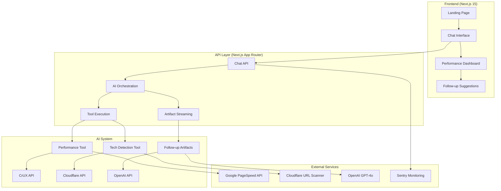
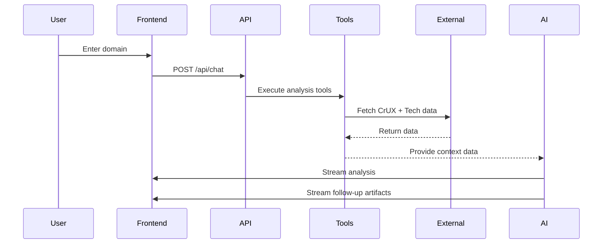

# Technical Architecture

WebVitals.com is built with a modern, scalable architecture designed for performance, maintainability, and developer experience.

## 🏗️ System Overview



## 📱 Frontend Architecture

### Next.js 15 App Router

**Framework Stack:**
- **Next.js 15.5.2**: React meta-framework with App Router
- **React 19.1.0**: Latest React with concurrent features
- **TypeScript**: Strict type safety throughout
- **TailwindCSS 4.x**: Utility-first styling with PostCSS

**Key Design Decisions:**
- **Server Components by Default**: Optimal performance and SEO
- **Client Components**: Only for interactivity (chat interface, animations)
- **Streaming**: Progressive enhancement with streaming responses
- **Static Generation**: Landing pages optimized for performance

### Component Architecture

```
components/
├── ui/                     # Design system components
│   ├── ai-elements/       # AI-specific components
│   └── *.tsx              # shadcn/ui base components
├── ChatInterface.tsx      # Main conversation UI
├── HeroSection.tsx        # Landing page hero
├── MessageRenderer.tsx    # Chat message display
├── FollowUpSuggestions.tsx # Dynamic follow-up UI
└── performance/           # Performance visualization
    ├── MetricCard.tsx
    ├── DistributionBar.tsx
    └── DeviceMetrics.tsx
```

**Component Patterns:**
- **Compound Components**: Flexible, composable UI elements
- **Controlled vs Uncontrolled**: Appropriate patterns for forms and state
- **Progressive Enhancement**: Works without JavaScript, enhanced with it
- **Accessibility First**: WCAG compliance built-in

### State Management

**AI SDK Store Pattern:**
```typescript
// Centralized chat state
const { messages, sendMessage, status } = useChat({
  api: '/api/chat',
  onFinish: handleAnalysisComplete,
  onError: handleAnalysisError,
});

// Artifact consumption
const followUpData = useArtifact(followUpActionsArtifact, {
  onStatusChange: handleStatusChange,
  onUpdate: handleDataUpdate,
});
```

**Context Providers:**
- **WebVitalsScoreContext**: Performance data sharing
- **ThemeProvider**: Dark/light mode management
- **AI Store Provider**: Chat state management

## 🔧 Backend Architecture

### API Design

**RESTful + Streaming Hybrid:**
```
app/api/
└── chat/
    └── route.ts           # Primary analysis endpoint
```

**Request/Response Pattern:**
```typescript
// Request
POST /api/chat
{
  messages: UIMessage[];
  performanceConfig?: PerformanceConfig;
}

// Response (Streaming)
{
  text: string;              // AI analysis
  toolCalls: ToolCall[];     // Data collection
  artifacts: Artifact[];     // Follow-up enhancements
}
```

### Tool Orchestration

**Parallel Execution:**
```typescript
// Tools execute simultaneously for optimal performance
const result = streamText({
  tools: {
    getRealWorldPerformance: realWorldPerformanceTool,
    detectTechnologies: techDetectionTool,
  },
  // AI coordinates tool execution automatically
});
```

**Error Handling Strategy:**
- **Graceful Degradation**: Continue with available data if one tool fails
- **Retry Logic**: Automatic retries for transient failures
- **Fallback Data**: Default responses when APIs are unavailable
- **Circuit Breaker**: Prevent cascading failures

### Streaming Architecture

**Real-time Data Flow:**
```typescript
const stream = createUIMessageStream({
  execute: ({ writer }) => {
    // Set up artifact context
    setContext({ writer, sessionId, analyzeUrl });
    
    // Main analysis streaming
    const analysis = streamText({ ... });
    writer.merge(analysis.toUIMessageStream());
    
    // Post-completion artifact generation
    analysis.onFinish(async () => {
      await generateFollowUpArtifacts();
    });
  },
});
```

## 🤖 AI System Architecture

### Tool-First Design

**Core Philosophy:**
- **Tools Collect Data**: Focused, single-purpose analysis functions
- **AI Interprets Data**: Contextual analysis using collected information
- **Artifacts Enhance UI**: Structured data streaming for progressive enhancement

### Tool Implementation

```typescript
// Real World Performance Tool
export const realWorldPerformanceTool = tool({
  description: "Get real-world performance data via CrUX",
  inputSchema: z.object({
    url: z.string(),
    devices: z.array(z.enum(['mobile', 'desktop'])).optional(),
  }),
  execute: async ({ url, devices }) => {
    // Fetch CrUX data from Google PageSpeed API
    // Transform and categorize performance metrics
    // Return structured performance data
  },
});
```

### Context Management

**Typed Context System:**
```typescript
interface WebVitalsChatContext extends BaseContext {
  sessionId: string;        // Unique session identifier
  analyzeUrl?: string;      // Currently analyzed URL
  writer: ArtifactWriter;   // For streaming artifacts
}

// Usage in tools and artifacts
const session = getCurrentSession();
```

### AI Prompt Engineering

**Layered Prompt Strategy:**
1. **System Prompt**: Core behavior and guidelines
2. **Tool Descriptions**: Specific tool capabilities
3. **Context Data**: Performance and technology information
4. **User Input**: Specific questions and requests

## 📊 Data Architecture

### Data Flow



### External API Integration

**Google PageSpeed Insights:**
- **Real User Data**: Chrome User Experience Report metrics
- **28-day Rolling Average**: Representative user experience
- **Device-Specific**: Separate mobile/desktop analysis
- **Rate Limited**: 1 hour cache, respectful usage

**Cloudflare URL Scanner:**
- **Technology Detection**: Framework and platform identification
- **Confidence Scoring**: Reliability metrics for detections
- **Comprehensive Coverage**: 1000+ technology patterns
- **Real-time Analysis**: Fresh data for each request

**OpenAI GPT-4o:**
- **Streaming Responses**: Real-time analysis delivery
- **Tool Calling**: Coordinated data collection
- **Context Awareness**: Technology-specific recommendations
- **Follow-up Generation**: Dynamic suggestion creation

## 🔒 Security Architecture

### API Security

**Authentication & Authorization:**
- **API Key Management**: Secure environment variable handling
- **Rate Limiting**: Built-in protection against abuse
- **Input Validation**: Zod schema validation for all inputs
- **Error Boundaries**: Graceful error handling without data exposure

**Data Privacy:**
- **No Persistent Storage**: Analysis data not permanently stored
- **Public Data Only**: Only analyze publicly accessible websites
- **Minimal Data Collection**: Only necessary performance metrics
- **GDPR Compliance**: No personal data collection or tracking

### Infrastructure Security

**Deployment Security:**
- **HTTPS Enforcement**: All traffic encrypted in transit
- **Security Headers**: XSS, CSRF, and clickjacking protection
- **Environment Isolation**: Separate dev/staging/production environments
- **Dependency Scanning**: Automated vulnerability detection

## 📈 Performance Architecture

### Frontend Optimization

**Loading Performance:**
- **Server Components**: Optimal rendering strategy
- **Code Splitting**: Route-based and component-based splitting
- **Image Optimization**: Next.js automatic optimization
- **Font Loading**: Efficient font loading strategy

**Runtime Performance:**
- **Memoization**: React.memo and useMemo for expensive calculations
- **Streaming**: Progressive content delivery
- **Virtualization**: Efficient large list rendering
- **Bundle Analysis**: Regular bundle size monitoring

### Backend Optimization

**API Performance:**
- **Parallel Execution**: Simultaneous tool execution
- **Response Caching**: 1-hour cache for external API responses
- **Connection Pooling**: Efficient HTTP connection management
- **Compression**: Automatic response compression

**Monitoring & Observability:**
- **Sentry Integration**: Comprehensive error tracking
- **Performance Monitoring**: Response time and throughput tracking
- **Health Checks**: System status monitoring
- **Alerting**: Automated incident response

## 🚀 Deployment Architecture

### Vercel Integration

**Platform Features:**
- **Edge Network**: Global CDN for optimal performance
- **Serverless Functions**: Automatic scaling and optimization
- **Build Optimization**: Turbopack for faster builds
- **Environment Management**: Secure environment variable handling

**CI/CD Pipeline:**
```yaml
Development → Testing → Staging → Production
     ↓          ↓         ↓          ↓
   Features → Quality → Integration → Release
```

### Scalability Design

**Horizontal Scaling:**
- **Stateless Design**: No server-side state dependencies
- **Edge Deployment**: Global distribution for low latency
- **Auto-scaling**: Automatic resource allocation
- **Load Balancing**: Distributed traffic handling

**Vertical Optimization:**
- **Memory Efficiency**: Optimized memory usage patterns
- **CPU Utilization**: Efficient algorithm implementation
- **I/O Optimization**: Minimized blocking operations
- **Resource Monitoring**: Continuous performance tracking

## 🔄 Development Workflow

### Local Development

**Hot Reloading:**
- **Turbopack**: Fast refresh for code changes
- **TypeScript**: Real-time type checking
- **Linting**: Continuous code quality checking
- **Testing**: Automated test execution

**Environment Parity:**
- **Docker Support**: Consistent development environments
- **Environment Variables**: Local .env.local configuration
- **API Mocking**: Local development API alternatives
- **Database Seeding**: Consistent test data

### Quality Assurance

**Automated Testing:**
- **Unit Tests**: Component and function testing
- **Integration Tests**: API and workflow testing
- **E2E Tests**: Complete user journey testing
- **Performance Tests**: Core Web Vitals monitoring

**Code Quality:**
- **TypeScript**: Strict type checking
- **Biome**: Code formatting and linting
- **Conventional Commits**: Standardized commit messages
- **Pre-commit Hooks**: Quality gates before commits

