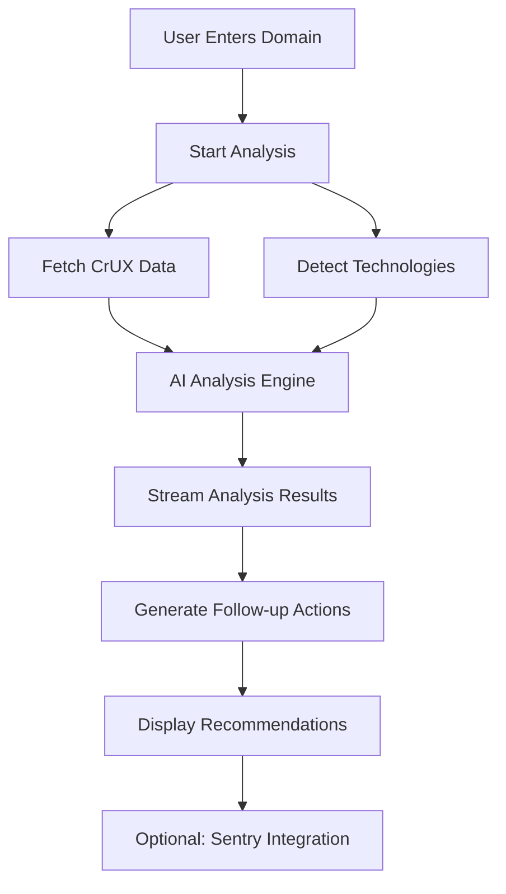

# Project Overview

WebVitals.com is an AI-powered web performance analysis platform that transforms Core Web Vitals from confusing metrics into clear, actionable insights.

## 🎯 Mission Statement

Create the most actionable web performance analysis tool that goes beyond scores to provide contextual, AI-powered recommendations for real improvement. Transform web vitals from confusing metrics into clear, implementable action items.

## 🚀 Key Features

### Intelligent Performance Analysis
- **Real User Data**: Chrome User Experience Report (CrUX) metrics from actual site visitors
- **Multi-Device Analysis**: Configurable mobile and desktop performance analysis
- **Historical Context**: Performance trends and patterns over time
- **Business Impact**: Understanding how performance affects user experience and conversions

### AI-Powered Insights
- **Contextual Recommendations**: AI analysis tailored to your specific technology stack
- **Implementation Guides**: Step-by-step instructions with code examples
- **Impact Scoring**: High/Medium/Low effort vs impact matrix for prioritization
- **Follow-up Suggestions**: Dynamic recommendations based on conversation context

### Technology-Aware Analysis
- **Automatic Detection**: Framework, CMS, and hosting platform identification via Cloudflare
- **Stack-Specific Advice**: React vs Vue vs vanilla JS optimizations
- **Hosting-Aware Suggestions**: Vercel vs Netlify vs traditional hosting recommendations
- **Architecture Analysis**: SPA vs MPA, SSR/SSG detection and optimization

### Real User Monitoring Integration
- **Sentry Integration**: Bridge static analysis with ongoing real user monitoring
- **Custom Snippet Generation**: Auto-generated Sentry configuration for your tech stack
- **Performance Regression Alerts**: Automated notifications for performance degradation
- **Synthetic vs RUM Comparison**: Compare lab data with real user experiences

## 🏗️ Technical Architecture

### Frontend Stack
```
Next.js 15.5.2 (App Router)
├── React 19.1.0
├── TailwindCSS 4.x
├── TypeScript (Strict)
├── Motion Animations
├── shadcn/ui Components
└── next-themes (Theme System)
```

### Backend Services
```
API Layer (Next.js App Router)
├── Google PageSpeed Insights API
├── Cloudflare URL Scanner API
├── OpenAI GPT-4o Integration
└── Sentry Monitoring
```

### AI System
```
AI-Powered Analysis
├── Real-world Performance Tool (CrUX Data)
├── Technology Detection Tool (Cloudflare)
├── Streaming Follow-up Artifacts
└── Context-aware Recommendations
```

## 🔄 Analysis Workflow



## 📊 Core Web Vitals Coverage

### Largest Contentful Paint (LCP)
- **What it measures**: Loading performance - when the largest content element becomes visible
- **Good threshold**: ≤ 2.5 seconds
- **Analysis focus**: Image optimization, server response times, resource loading

### First Input Delay (FID) / Interaction to Next Paint (INP)
- **What it measures**: Interactivity - time between user interaction and browser response
- **Good threshold**: FID ≤ 100ms, INP ≤ 200ms
- **Analysis focus**: JavaScript execution, main thread blocking, event handlers

### Cumulative Layout Shift (CLS)
- **What it measures**: Visual stability - unexpected layout shifts during page load
- **Good threshold**: ≤ 0.1
- **Analysis focus**: Image dimensions, font loading, dynamic content insertion

### Additional Metrics
- **First Contentful Paint (FCP)**: First text/image paint
- **Time to First Byte (TTFB)**: Server response performance
- **Total Blocking Time (TBT)**: Main thread blocking time

## 🎯 Competitive Advantages

| Feature | WebVitals.com | PageSpeed Insights | GTMetrix | Pingdom |
|---------|---------------|-------------------|----------|---------|
| AI-Powered Analysis | ✅ | ❌ | ❌ | ❌ |
| Tech-Aware Recommendations | ✅ | ❌ | ❌ | ❌ |
| Real User Data (CrUX) | ✅ | ✅ | Limited | ❌ |
| Technology Detection | ✅ | ❌ | ❌ | ❌ |
| Implementation Guides | ✅ | Limited | Limited | ❌ |
| Conversational Interface | ✅ | ❌ | ❌ | ❌ |
| Framework-Specific Advice | ✅ | ❌ | ❌ | ❌ |
| RUM Integration | ✅ | ❌ | Limited | ✅ |

## 🔍 Problem Statement

Current web performance tools suffer from:

- **Score without Substance**: Users get ratings but don't understand what to fix
- **Generic Recommendations**: One-size-fits-all advice that doesn't consider tech stack
- **Analysis Paralysis**: Too much data, not enough actionable insights
- **Disconnect from Reality**: Synthetic testing vs. real user experience data
- **Educational Gap**: Most developers don't deeply understand web vitals impact

## 💡 Solution Approach

WebVitals.com addresses these problems through:

1. **AI-Powered Context**: Understanding your specific technology stack and providing relevant advice
2. **Real User Focus**: Prioritizing actual user experience data over synthetic tests
3. **Actionable Insights**: Clear implementation guides with code examples
4. **Continuous Monitoring**: Integration with Sentry for ongoing performance tracking
5. **Educational Content**: Built-in explanations of why performance matters

## 📈 Success Metrics

### User Engagement
- Analysis completion rate
- Follow-up question engagement
- Implementation guide downloads
- Sentry integration conversion

### Business Impact
- Site performance improvements
- User experience enhancements
- Developer education and awareness
- Community growth and adoption

### Technical Excellence
- Analysis accuracy and relevance
- Response time and reliability
- User satisfaction scores
- Platform performance and uptime

